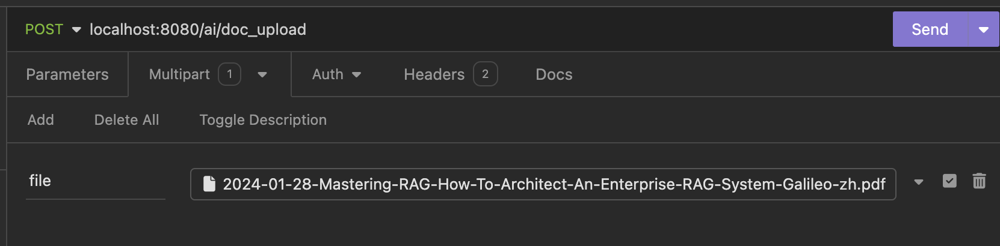
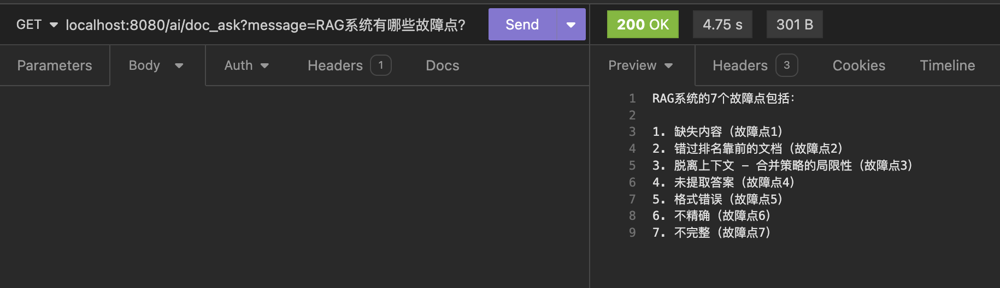

Spring AI 官网介绍：

```text
Spring AI 项目旨在简化开发集成了人工智能功能的应用程序的流程，力求去除复杂性。

这个项目受到了若干知名 Python 项目的启发，比如 LangChain 和 LlamaIndex，但并不是对它们的直接复制。项目的创始信念是，接下来的生成式 AI 应用将不再仅限于 Python 开发者，它们将遍布各种编程语言之中。

Spring AI 的核心在于提供一套开发 AI 应用的基础抽象。这套抽象有着多种实现方式，让你能够通过极少的代码修改来轻松替换组件。

Spring AI 提供的特性包括：

- 支持所有主流的模型提供方，如 OpenAI、Microsoft、Amazon、Google 及 Huggingface。
- 目前支持的模型类型有 Chat 聊天模型和 Text to Image 文本转图片模型，未来将支持更多类型。
- 为 Chat 和 Embedding 模型提供跨各大 AI 提供商的通用 API。支持同步和流式的 API 选项，并允许深入访问特定模型的功能。
- 将 AI 模型的输出映射到 POJOs 纯数据对象。
- 为所有主流的向量数据库提供商提供支持，包括 Azure Vector Search、Chroma、Milvus、Neo4j、PostgreSQL/PGVector、PineCone、Redis 以及 Weaviate。
- 提供一套跨向量存储提供商通用的 API，其中包括一种类 SQL 的元数据筛选 API，也同样通用。

还包括函数调用、为 AI 模型和向量存储配置的 Spring Boot 自动配置及启动器、以及用于数据工程的 ETL 框架。

这些功能集成允许你实现像是“基于文档的问答”或“与文档互动聊天”这样的常见用例。
```

**以下是使用用 Spring AI 和 PGVector 构建 RAG 的一个简单示例。**

1. pom.xml引入相关依赖, ${spring.ai.version} 目前版本为0.8.0-SNAPSHOT。

```xml
        <dependency>
            <groupId>org.springframework.ai</groupId>
            <artifactId>spring-ai-openai-spring-boot-starter</artifactId>
            <version>${spring.ai.version}</version>
        </dependency>

        <dependency>
            <groupId>org.springframework.ai</groupId>
            <artifactId>spring-ai-pdf-document-reader</artifactId>
            <version>${spring.ai.version}</version>
        </dependency>

        <dependency>
            <groupId>org.springframework.boot</groupId>
            <artifactId>spring-boot-starter-web</artifactId>
        </dependency>

        <!-- Database -->
        <dependency>
            <groupId>org.springframework.boot</groupId>
            <artifactId>spring-boot-starter-jdbc</artifactId>
        </dependency>

        <dependency>
            <groupId>org.postgresql</groupId>
            <artifactId>postgresql</artifactId>
            <scope>runtime</scope>
        </dependency>

        <dependency>
            <groupId>org.springframework.ai</groupId>
            <artifactId>spring-ai-pgvector-store-spring-boot-starter</artifactId>
            <version>${spring.ai.version}</version>
        </dependency>
```

2. 声明相关的Bean

```java
@Configuration
public class AIConfig {
    @Bean
    public VectorStore vectorStore(JdbcTemplate jdbcTemplate, EmbeddingClient embeddingClient) {
        return new PgVectorStore(jdbcTemplate, embeddingClient);
    }

    @Bean
    TokenTextSplitter tokenTextSplitter() {
        return new TokenTextSplitter();
    }
}
```

3. 定义两个API，一个API用来上传pdf文件存储到PGVector，一个API用来针对pdf文件的内容向ChatGPT提问.

```java
@RestController
public class RAGController {

    private final String template = """
                        
            You're a DOCUMENT assistant.
            Use the information from the DOCUMENTS section to provide accurate answers but act as if you knew this information innately.
            If unsure, simply state that you don't know.
                    
            DOCUMENTS:
            {documents}
                        
            """;

    private final OpenAiChatClient chatClient;

    private final VectorStore vectorStore;

    private final TokenTextSplitter tokenTextSplitter;


    @Autowired
    public RAGController(OpenAiChatClient chatClient, VectorStore vectorStore, TokenTextSplitter tokenTextSplitter) {
        this.chatClient = chatClient;
        this.vectorStore = vectorStore;
        this.tokenTextSplitter = tokenTextSplitter;
    }

    @GetMapping("/ai/doc_ask")
    public String doc_ask(@RequestParam(value = "message", defaultValue = "Hi") String message) {
        List<Document> listOfSimilarDocuments = vectorStore.similaritySearch(message);
        String documents = listOfSimilarDocuments.stream()
                .map(Document::getContent)
                .collect(Collectors.joining(System.lineSeparator()));

        Message systemMessage = new SystemPromptTemplate(this.template)
                .createMessage(Map.of("documents", documents));
        UserMessage userMessage = new UserMessage(message);
        Prompt prompt = new Prompt(List.of(systemMessage, userMessage));
        ChatResponse aiResponse = chatClient.call(prompt);
        return aiResponse.getResult().getOutput().getContent();
    }

    @PostMapping("/ai/doc_upload")
    public Map doc_upload(MultipartFile file) throws IOException {
        File localFile = convertMultiPartToFile(file);
        PagePdfDocumentReader pdfReader = new PagePdfDocumentReader(new FileSystemResource(localFile));
        TokenTextSplitter textSplitter = new TokenTextSplitter();
        vectorStore.accept(textSplitter.apply(pdfReader.get()));

        return Map.of("result", "upload done");
    }


    private File convertMultiPartToFile(MultipartFile file) throws IOException {
        //store upload file to somewhere on server
        File convFile = new File(file.getOriginalFilename());
        try (FileOutputStream fos = new FileOutputStream(convFile)) {
            fos.write(file.getBytes());
        }
        return convFile;
    }

}
```

4. 使用Docker启动Postgres & PGVector

```bash
docker pull ankane/pgvector

docker run -d --name postgres_spring_ai -p 5432:5432 -e POSTGRES_USER=postgres -e POSTGRES_PASSWORD=postgres ankane/pgvector
```

5. 连上数据库，创建向量存储表

```sql
CREATE EXTENSION IF NOT EXISTS vector;
CREATE EXTENSION IF NOT EXISTS hstore;
CREATE EXTENSION IF NOT EXISTS "uuid-ossp";

CREATE TABLE IF NOT EXISTS vector_store (
	id uuid DEFAULT uuid_generate_v4() PRIMARY KEY,
	content text,
	metadata json,
	embedding vector(1536)
);

CREATE INDEX ON vector_store USING HNSW (embedding vector_cosine_ops);
```

6. 运行项目，上传pdf文件，然后就可以针对pdf文件的内容向ChatGPT提问啦。

上传pdf

GPT分析文档并给出准确的答案


完整代码地址：[spring_ai_example](https://github.com/yangchuang/spring_ai_example)